# Background on Taxonomy-Guided Prompting

In our research we generate synthetic candidate activities with an instruction-tuned, decoder-only transformer (Gemma 2) and constrain outputs via schema-guided prompting. Concretely, generation is conditioned on a human-curated taxonomy that represents the life-world of 10–14-year-olds in Flanders. The taxonomy is grounded in the *International Classification of Functioning, Disability and Health for Children and Youth (ICF-CY)* from the *World Health Organization (WHO)* and refined with input from an educational expert; it comprises 9 domains, 27 subdomains, and 123 facets. Each prompt combines (a) a fixed instruction block—role, audience, style and length targets, safety constraints, and output format—and (b) a variable block for exactly one facet in our taxonomy, which provides domain/subdomain/facet context, defines the task, and includes three few-shot examples to set tone and intent.
This document offers some more background on this approach and its implementation. We offer a brief summary on schema/ontology-guided prompting in scientific literature, give more information on ICF-CY and the expert-curated schema we use, and offer concrete prompt templates with facet-level examples to illustrate our implementation.

## 1. Ontologies & schemata to keep LLMs on task
A growing body of work shows that structured knowledge—ontologies, schemata, or taxonomies—can steer LLMs toward more relevant, faithful, and controllable outputs. Such structure has been used for a *variety of tasks*: from encoding ontologies into prompts to improve few-shot relation and event extraction (Ye et al., 2022), to building personal knowledge graphs from user text (Çöplü et al., 2024), to mapping construction images to activity labels (Zeng et al., 2025). It is also widely used to constrain or condition text generation: schema-guided NLG conditions outputs on task schemas (Du et al., 2020); WebNLG targets data-to-text generation from RDF triples (Gardent et al., 2017); in summarization, ontology-based prompt tuning improves ROUGE/F1 (Silva & Priyadarshana, 2025), and ontology-guided constrained decoding reduces hallucinations while increasing domain specificity in clinical summaries (Mehenni & Zouaq, 2024). Most of these studies *represent structure* in machine-readable ontologies and knowledge graphs, while some rely on lightweight, human-curated schemata (e.g., Du et al., 2020; Silva & Priyadarshana, 2025). *Content-wise*, there are mature ontologies for medical (e.g., SNOMED-CT), construction (ConSE/DiCon-SII), and general everyday knowledge (KNOW). By contrast, we found no schema tailored to the everyday life-world of children and youth. 
We use a taxonomy to generate synthetic text data by means of an instruction-tuned LLM. This means our study falls on the generation side and uses a human-readable, task-specific schema at prompt time. To fit the domain at hand, we designed a taxonomy of the life-world of 10–14-year-olds.

## 2. The International Classification of Functioning, Disability and Health for Children and Youth (ICF-CY)

The *International Classification of Functioning, Disability and Health (ICF)* is the World Health's Organization's conceptual framework for health and disability. It was endorsed by by the World Health Assembly in 2001 and extended in 2007 with  a version specifically aimed at *Children and Youth (ICF-CY)*. It aims to provide a classification system that allows to document, organize and analyze information on the health of children and adolescents across disciplines and sectors.

Health and disability are understood as 'functioning in society' and are considered both from a medical and a social perspective. From a *medical perspective*, disability arises from intrinsic impairment (disease/disorder/trauma) and is addressed via diagnosis and intervention; from a *social perspective* disability emerges from environmental and attitudinal barriers that limit participation. The ICF-CY therefore treats health as a complex phenomenon that is conditioned by the interplay of body functions and structures on the one hand (component 1.A), and being able to perform activities and to participate in society on the other (component 1.B). This interplay is, moreover, influenced by both contextual (component 2.A) and personal factors (component 2.B).

The ICF organizes the information gained from analysing the interactions between these elements in a hierarchical structure (Figure 1). The structure is operationalised by the systematic allocation of codes. An alphanumerical system is employed to indicate the nature and extent of functioning or disability. Granularity refers to the level of categorical detail provided. 

. Central in this social take on health is the distinction between performance and capacity. Performance describes the actual activities of a child in the context in which he or she lives presently. It is a descriptor of his or her lived experience. Capacity refers to the child’s ability to perform a task or action. The ICF-CY framework uses standardised classification levels to assess the person’s highest probable level of functioning or full capability. Collecting data on both potential and actual functioning of the child enables the professional who uses the ICF-CY framework to measure health from a social perspective as the ‘gap’ between performance and capacity. 

  
*Figure 2: ICF-CY component 1.B — Activities & Participation*

To build our taxonomy, we have further also included the first three chapters of 2.A 'Environmental Factors' (leaf codes e110 -  e399) of the classification (see Figure 3). 

  
*Figure 3: ICF-CY component 2.A — Environmental Factors*

The fact that ICF-CY focuses specifically on children and youth and that it targets education as a principal stakeholder made it an obvious starting-point for the development of our own taxonomy. Moreover, the way the ICF-CY operationalizes the documentation of health from a social perspective by means of concrete activities made it a perfect fit for our situation, an original dataset consists of 96 short activity sentences, and aim, to enrich this dataset by generating synthetic activity sentences covering all aspects of everyday lived experience of a 10-14 year old.

## 3. Taxonomy for 10–14-year-olds

Using the social model of ICF-CY as our conceptual backbone, we constructed a taxonomy in collaboration with a Flemish secondary-education expert that reflects the everyday lifeworld of 10–14-year-olds in Flanders (2025). We collapsed overly granular codes, relabeled items into reader-friendly facet names, and organized the result into *9 domains* (see Figure 4).


*Figure 4: Taxonomy overview — 9 domains*

Each domain is further divided into subdomains, and each subdomain into facets— *27 subdomains* and *123 facets* in total. Below we show the subdomains of *Domain 1 (Education)* as an example (Figure 5):


*Figure 5: Domain 1 (Education) — subdomains*

And these are, for example, the facets for *Subdomain 1 of Domain 1 (Learning activities)* (Figure 6):


*Figure 6: Subdomain 1 (Learning activities) — facets*

The full taxonomy can be consulted in:
- Dutch: [`data/taxonomy_dutch.json`](../data/taxonomy_dutch.json)
- English: [`data/taxonomy_english.json`](../data/taxonomy_english.json)

In the `data/` folder, we have also included the mapping of each facet to one (or a small set of) ICF-CY codes.

## 4. Facet-conditioned prompt design

We generate activities with a two-part prompt: a *fixed block* (always the same rules), and a facet-specific variable block (one facet at a time, carrying task, palettes, constraints, and few-shot examples). The fixed block instructs the model to produce short, kid-friendly Dutch activity sentences (CEFR A2–B1), exactly 16 lines, lowercase, no punctuation, one action per line, and to adhere to safety and formatting constraints. The *variable block* injects context (domain, subdomain, facet), a task, lexical palettes (suggested verbs/objects/settings), quotas/constraints, and three tone-setting examples.

> Note on language:  
> The prompt text below is documented in English for readability, but it is formulated in Dutch in the original and explicitly asks the model to output Dutch.

---

### 4.1 Fixed block — **Pattern**

```text
You are an educational copywriter. Write SHORT, CHILD-FRIENDLY Dutch activity sentences that each express exactly one concrete action.

RULES
- Output Dutch only; no emoji; no English words
- Exactly 16 lines; each line numbered 1. … 16.
- Each sentence is 5–12 tokens; all lowercase
- No punctuation (no dots, commas, hyphens, colons, etc.)
- No intro or outro; output the sentences only
- Use the setting only as inspiration; do not name the location explicitly
- Vary verbs, objects, and settings; avoid duplicates
- Keep content safe and age-appropriate: no brands, no PII, no adult themes, no illegal or dangerous instructions
- No negation flips relative to examples; no exact quantities/money unless requested; no compound sentences

FORMAT
Give 16 lines, exactly numbered as:
1. <sentence>
2. <sentence>
...
16. <sentence>
```

---

### 4.2 Variable block — **Pattern**

Each run targets one facet. We pass the facet context, task, palettes, constraints, and three examples.

```text
ASPECT: <Domain> → <Subdomain>
SUBASPECT/FACET: <Facet name>
TASK: <What to produce>

LEXICAL PALETTES (inspiration, optional)
- verbs: <comma-separated Dutch verbs>
- objects: <comma-separated Dutch objects/materials>
- settings: <comma-separated Dutch settings>

CONSTRAINTS (soft quotas)
- <short quota statements in English; optional>

EXAMPLES (Dutch, tone-setting; not seeds)
- <example 1>
- <example 2>
- <example 3>
```

**Example of a variable block for facet 1 of subdomain 1 of domain 1: Classroom instruction (facet_id: 1.1.1)**

```json
{
  "domain": "Education domain",
  "domain_id": "1",
  "subdomain": "Learning activities",
  "subdomain_id": "1.1",
  "facet": "Classroom instruction",
  "facet_id": "1.1.1",
  "task": "Formulate 16 activities where students take part in instruction-led teaching by listening, taking notes, asking questions, or taking turns.",
  "lexical": {
    "verbs": ["listen", "take notes", "write down", "ask", "answer", "take part", "respond", "summarize", "repeat", "clarify", "pay attention", "keep track", "highlight", "write along"],
    "objects": ["explanation", "instruction", "story", "presentation", "teacher's explanation", "clarification", "example", "demonstration", "notes", "diagram", "keywords", "main points"],
    "settings": ["classroom", "computer lab", "library corner", "gym"]
  },
  "constraints": {
    "verb_distribution": "at least 5 lines with listen/pay attention, 4 lines with take notes/write down, 4 lines with ask/answer, 3 mixed",
    "interaction": "at least 6 lines with active response/communication",
    "cognitive_levels": "vary between passive reception (listening) and active processing (asking questions, summarizing)"
  },
  "examples": [
    "listen attentively to the explanation",
    "ask a question about the subject matter",
    "write down the lesson's keywords"
  ]
}
```

The full series of variable blocks (facet 1.1.1. → facet 9.3.5) can be consulted in the Dutch original under `config/prompt_variable-blocks/` as JSON files organized by subdomain: `vb_1.1.json`, `vb_1.2.json`, etc..

